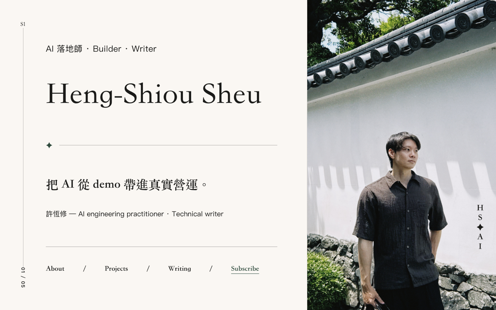

# 🔨 portfolio-forge

> 把「一個人的資訊」鍛造成**美感極佳、可上線**的個人網站。
> A Claude Code skill that forges personal information into a beautiful, production-ready personal website.

**📖 介紹頁(GitHub Pages)→ https://heng-xiu.github.io/portfolio-forge/**
**🌐 實際成果 → https://hengshiou-portfolio.pages.dev**

AI 時代,個人網站就是你的履歷。這個 skill 讓你在 Claude Code 裡講一句「幫我做個人網站」,就能走完一條**被實戰驗證過**的流水線:

```
內容文檔(唯一真值) → 參考圖 → 對抗式評審 → 高保真複刻 → 逐段 QA → 可逆部署
```



## 為什麼不直接讓 AI 隨手生一個?

因為隨手生的站總是差一口氣:幻覺經歷、字級爆版、沒有呼吸感、每個區塊都「左字右圖」、上線才發現圖裂了。

portfolio-forge 固化了三個**真正決定質感**的環節:

| 環節 | 一般做法 | portfolio-forge |
|---|---|---|
| **防幻覺** | AI 邊做邊編 | 先寫 `CONTENT.md` 當唯一真值,亂字一律以文檔為準 |
| **審美把關** | 參考圖生完直接複刻 | **對抗式逐張評審**:字級/呼吸感/構圖套路/幻覺文字/跨圖一致,不過關就單張重生 |
| **上線驗收** | build 成功就交付 | headless 逐段截圖對照參考圖;部署後 smoke test,不碰你既有網域 |

## 安裝

```bash
git clone https://github.com/Heng-xiu/portfolio-forge.git ~/.claude/skills/portfolio-forge
```

重啟 Claude Code,然後說:**「幫我做個人網站」** 或 `/portfolio-forge`。

### 前置依賴(skill 會引導你裝)

1. **imagegen-frontend-web**(taste-skill)— 高審美 section 參考圖引擎
2. **build-web-apps**(Codex plugin)— Frontend App Builder,負責高保真複刻:`codex plugin add build-web-apps@openai-curated`
3. **Chrome + puppeteer-core** — headless 逐段 QA 截圖

## 六階段流水線

| # | 階段 | 做什麼 |
|---|---|---|
| 0 | 定位訪談 | 結構化提問收斂:給誰看、風格、語言、素材、CTA |
| 1 | 內容文檔 | 訪談 + 外部資料 → `CONTENT.md`(唯一真值) |
| 2 | 生成參考圖 | 一個 section 一張高審美參考圖 |
| 3 | **對抗式評審**(靈魂) | 逐張挑戰、不過關單張重生,來回幾輪是正常的 |
| 4 | 高保真複刻 | 定稿參考圖 + 文檔 + 真實素材 → Codex 1:1 還原 |
| 5 | 逐段 QA | puppeteer 真實捲動截圖,對照參考圖驗收 |
| 6 | 可逆部署 | Cloudflare Pages 獨立網址 → smoke test → 網域決策交還你 |

## 檔案結構

```
SKILL.md                          # skill 主體(觸發條件、原則、流程)
references/
  content-doc-template.md         # CONTENT.md 模板
  design-style-library.md         # 視覺風格庫(訪談選項)
  qa-checklist.md                 # 逐段 QA 驗收清單
workflows/
  content-intake.md               # 階段 0-1:訪談 + 內容文檔
  reference-image-gen.md          # 階段 2:參考圖生成
  adversarial-design-review.md    # 階段 3:對抗式評審
  frontend-replication.md         # 階段 4:高保真複刻
  headless-qa-and-deploy.md       # 階段 5-6:QA + 部署
docs/                             # 本 repo 的 GitHub Pages 介紹站
```

## License

MIT © [Heng-Shiou Sheu](https://hengshiou-portfolio.pages.dev)
